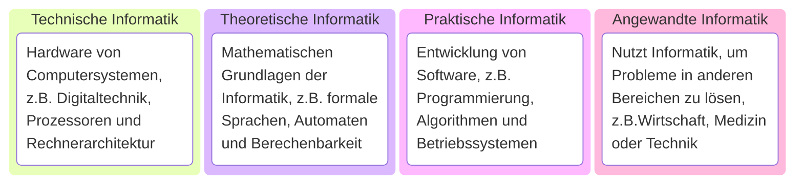

## Informatik

```mermaid
kanban
  id1[Technische Informatik]
    id11[Hardware von Computersystemen, z.B. Digitaltechnik, Prozessoren und Rechnerarchitektur]
  id2[Theoretische Informatik]
    id21[Mathematischen Grundlagen der Informatik, z.B. formale Sprachen, Automaten und Berechenbarkeit]
  id3[Praktische Informatik]
    id31[Entwicklung von Software, z.B. Programmierung, Algorithmen und Betriebssystemen]
  id4[Angewandte Informatik]
    id41[Nutzt Informatik, um Probleme in anderen Bereichen zu lösen, z.B.Wirtschaft, Medizin oder Technik]
```
