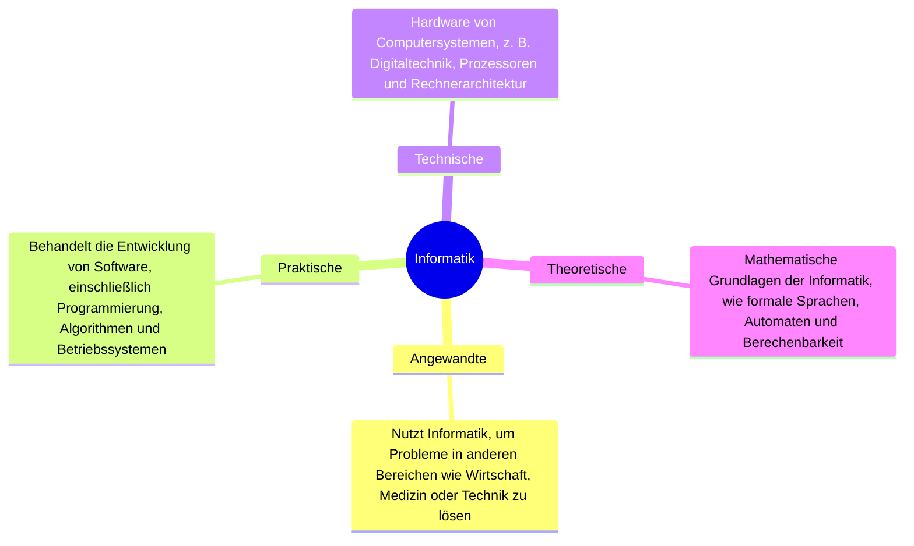

```mermaid
mindmap
  root((Informatik))
    Angewandte
      Nutzt Informatik, um Probleme in anderen Bereichen wie Wirtschaft, Medizin oder Technik zu lösen
    Praktische
      Behandelt die Entwicklung von Software, einschließlich Programmierung, Algorithmen und Betriebssystemen
    Technische
      Hardware von Computersystemen, z. B. Digitaltechnik, Prozessoren und Rechnerarchitektur
    Theoretische
      Mathematische Grundlagen der Informatik, wie formale Sprachen, Automaten und Berechenbarkeit
```
