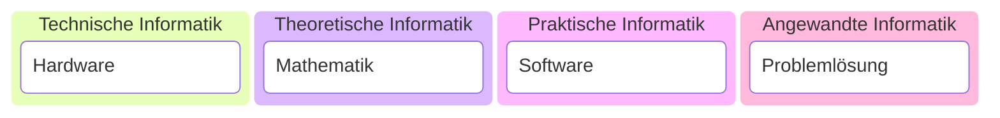

```mermaid
kanban
  id1[Technische Informatik]
    id11[Hardware]
  id2[Theoretische Informatik]
    id21[Mathematik]
  id3[Praktische Informatik]
    id31[Software]
  id4[Angewandte Informatik]
    id41[Problemlösung]
```

--

#test1

--

#test2
