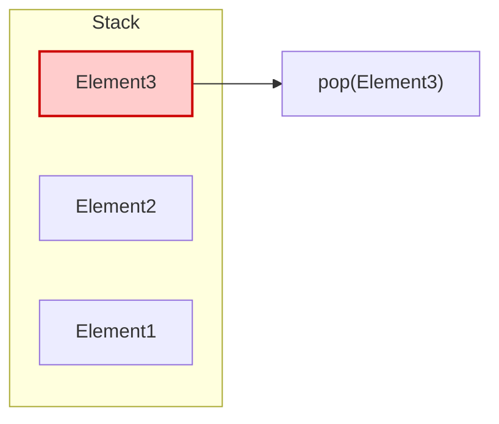

## Stack

pop entfernt das oberste Element im Stack

```mermaid
flowchart LR
    pop["pop(Element3)"]
    
    subgraph Stack
        C["Element3"]
        B["Element2"]
        A["Element1"]
    end
    
    C --> pop

style C fill:#ffcccc,stroke:#cc0000,stroke-width:2px

```
