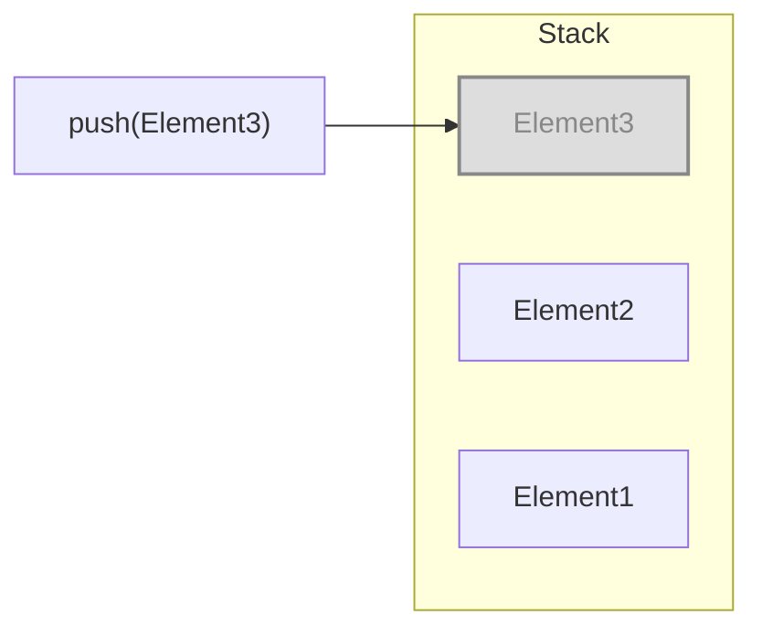

## Stack

push fügt an der obersten Stelle ein neues Element hinzu

```mermaid
flowchart LR
    push["push(Element3)"]
    
    subgraph Stack
        C["Element3"]
        B["Element2"]
        A["Element1"]
    end
    
    push --> C

style C fill:#ddd,stroke:#888,color:#888,stroke-width:2px
```
